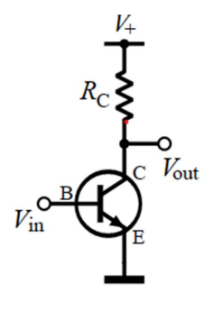
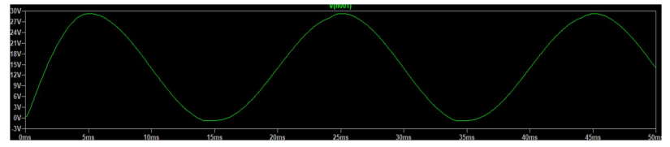
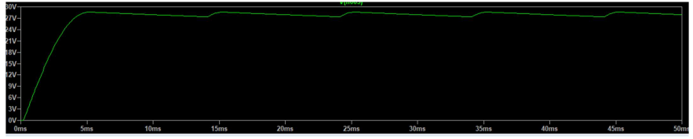
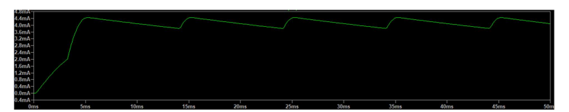
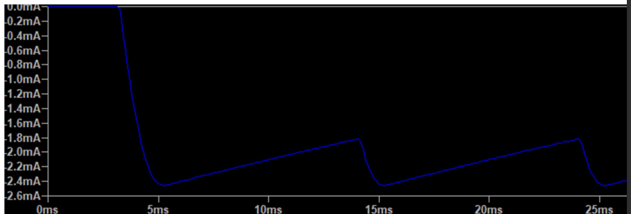
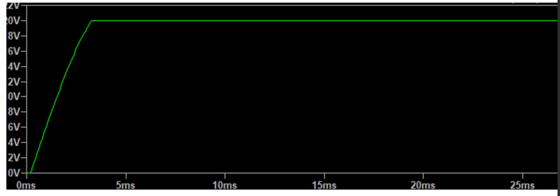
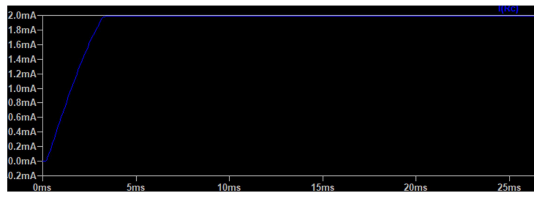

## Introduction 
 ## What are Bipolar junction Transistors 
A BJT in its full form is written as bipolar junction transistor and we can define it as, "A bipolar 
junction transistor is a three-terminal semiconductor device which is made up of two PN 
junctions within its structure and is mainly used to amplify current." 
- Prior to the bipolar junction transistors, vacuum tubes were used in electronic circuits 
which were highly expensive, those too were available in the form of a triode which 
was a three-terminal device like a transistor back then. 

**the NPN Bipolar junction Transistor has the majority of charge carriers as electrons.**  
**The PNP Bipolar junction Transistor has the majority of charge carriers as holes.**

The current flow is not the result of majority charge carriers despite their quantity, the 
current flow is due to minority charge carriers in a bipolar junction transistor that is why 
they are also named as minority carrier devices. 
- The emitter-base junction is always forward biased. 
- The collector-base junction represented by CB is always reverse biased. 
- The Emitter current is written as IE=IB + IC 
- If we consider base current to be very small in actual measurement then we can say that; 
IE~IC 
 ## Biasing a BJT

Generally speaking, transistor biasing involves applying a specific amount of voltage to a BJT’s 
base and emitter terminals, improving its efficiency and performance. In this case, the process 
enables a transistor to amplify an AC input signal in a transistor circuit. So biasing the BJT will 
set the emitter-base junction in a forward-biased state. Meanwhile, the base-collector 
intersection will configure to a reverse-biased state. Thus, it will operate in the active region. 
Also, the collector resistor should have a rating that allows the collector-emitter voltage to 
exceed **0.5V** for germanium transistors and **1V** for silicon transistors. 

- There are different ways to bias a transistor, but for this project common emitter method is covered. 
- In electronics, a common-emitter amplifier is one of three basic single-stage bipolar-junction transistor (BJT) amplifier topologies, typically used as a voltage amplifier. It offers high current 
gain (typically 200), medium input resistance and a high output resistance. The output of a 
common emitter amplifier is 180 degrees out of phase to the input signal.

- In this circuit the base terminal of the transistor serves as the input, the collector is the output, 
and the emitter is common to both (for example, it may be tied to ground reference or a power 
supply rail), hence its name

 <!-- image of a transistor-->

# AC to DC power supply 
Converting AC to Dc has some important steps:- 
1. **Transformers**

 voltages need to be decreased for equipment that uses  lower power. The step-up 
transformers are  used for stepping up the voltage levels and step-down 
transformers are  used for stepping down the voltage levels.

2. **AC to DC Power Converter Circuit** 

The rectifier converts the AC supply into the DC supply at the load end connection. There are 
different types of rectifiers, such as half-wave, full-wave, and bridge rectifiers. 

3, **Obtaining Pure DC Waveform**

We need to convert the pulsating DC to pure DC. To do that, most of the circuits use a 
Capacitor. The capacitor is used to store energy while the input voltage is increasing from zero 
to its peak value. The energy from the capacitor can be discharged while the input voltage is 
decreasing from its peak value to zero. 

4. **Regulating Fixed DC Voltage** 

In order to fix the output voltage to the fixed desired value, we finally use the voltage regulator 
IC. The DC voltage regulators IC comes with the name 78XX. The last two digits XX-represents 
the output voltage value. For example, to limit the output voltage to 5V, we use 
the 7805 Voltage Regulator IC. And to limit the voltage to 9V, we use a 7809 Voltage regulator 
IC. 

## Design and procedure

**The design of this project was done using the application LTspice**. 
### A. the step-down transformer

The input for the transformer is a day to day used 220V vrms at 50hz. But in the LT spice 
application a peak value is used. There for; - Vpeak= √2*vrms= 220 * 1.4142= 311.1V at 50 hz and a voltage source is used from the directory of LT spice to simulate the source at the given values.

- Next a transformer is used to step down the voltage to a required amount. But because 
LT spice doesn’t have a direct method to represent a transformer, a coupled inductors 
with coupling constant one is used and the spice directive **K L1 L2 1** is used to couple 
them.

A 0.001mῺ inductor resistor is connected in series with the primary inductor in order for LT 
spice to simulate correctly. The formula √Lp/√Ls= Vp/Vs is used to step down the voltage to a required amount. For our case the secondary voltage is 30V and choosing the primary inductance to be 1H, we 
get a secondary inductance of **Ls= 9.297mH**.

### B. full wave bridge rectifier

- Four diodes of type 1N914 are used next to the inductor in order to rectify our stepped down 
signal with peak voltage of 30V. this full rectification will remove the negative part of our input 
and change the signal to a one side AC. But because the 2 active diodes have a voltage drop of 
0.7 each, we will have a total of 1.4V drop from our peak value of 30V.

 - Our signal after the bridge rectifier looks like this
  <!-- image after passing through the transformer -->
### C, The smoothing filter 
- Input: Rectified voltage, Output: filtered voltage with a maximum ripple voltage of VRpp=2V 
(for a full wave)

- For the smoothing filter, a **capacitor** is used change the rectified voltage to an almost constant 
DC with only ripple voltage. We can ideally use large capacitors in order to have a very 
smooth DC, but for actual purposes we need to use relatively small capacitors. There for using the  
formula **C= Vp/2*RL*f*Vrpp**
Where Vp= 28.690928, f=50HZ, RL= 10kohm and Vrpp=1V—substituting these values we get a 
capacitance of **C= 0.0289mF** 

After filtering 

  <!-- image after passing through the smoothing filter -->

From measurement on graph, our **Vrpp is 1.123V**, which is a tolerable range. 

### D, Zener regulator

- A Zener regulator is used to set a maximum DC voltage passing to our load resistor, A Zener 
diode with a break down voltage of **20v** and max current of **5mA** is used (EDZV20B). because 
under the design assumption  the current passing through diode Id= half of break down current= 
2.5mA.and IL=2mA 
the current through I1= 2mA+2.5mA=4.5mA 
this implies by ohms law that 
R1= VL/IL, VL= 28.6909-20= 8.96909V and 
R1= 1931ohms 

The graph for I1 becomes

  <!-- image of the current I1 after zener regulator  -->

The graph for Id becomes 
  <!-- image of the current Id after zener regulator  -->

The graph for Vcc becomes

 <!-- image of the Vcc after zener regulator  -->

The graph for IL becomes

 <!-- image of the IL after zener regulator  -->

### Summary 
- from the above graph, Vcc is set at a constant value of 20V
- the current through Rc was set at 2mA, which is the required value
- the current through the diode was set at 2.5mA, which is half of the breakdown 
current for our selected diode 
- the capacitor was given a value that could be commercially available. 

